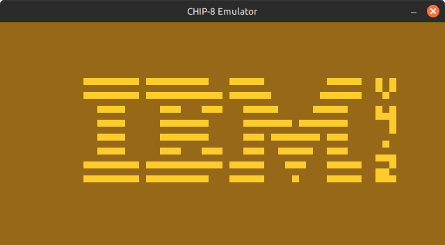

# rem8C - CHIP-8 Emulator

A CHIP-8 emulator made in C.

This emulator was developed for the sake of learning and understanding the core functionality of computer systems at
a rudimentary level. I primarily referenced [this page by mattmikolay](https://github.com/mattmikolay/chip-8/wiki/Mastering-CHIP%E2%80%908)
when developing the emulator and utilized [Timendus's CHIP-8 test suite](https://github.com/Timendus/chip8-test-suite/tree/main)
to evalute the functionality and accuracy of my emulator.

<sub>Some tests from [Timendus's CHIP-8 test suite](https://github.com/Timendus/chip8-test-suite/tree/main) running on the emulator:</sub>
<p align='center'>
  
  
  
  
</p>

## Downloading and Compiling
This project uses Make (`make`) as it's build system and SDL2 (`libsdl2-dev`) for graphics. Ensure you have both installed.

To download and build the project:
```sh
$  git clone https://github.com/RyanVNgo/rem8C
$  cd rem8C
$  make
```

## Running
For most CHIP-8 roms, you can just run the following:
```sh
$  ./rem8C -r <ROM File>
```

There are some additional configuration arguments if needed:
```
Usage:
  ./rem8C -r <ROM File> [-l {200}] [-s {200}]

Options:
  -l  <load_addr>     Address, in hex bar the decorator (i.e. 200 not 0x200), to load the ROM.
  -s  <start_addr>    Address, in hex bar the decorator (i.e. 200 not 0x200), to start running.
```

## Input
The keypad input of rem8C is mapped as follows:

<p align='center'>
  
</p>

Additional keybinds:
- `esc`  - Exit the emulator.

